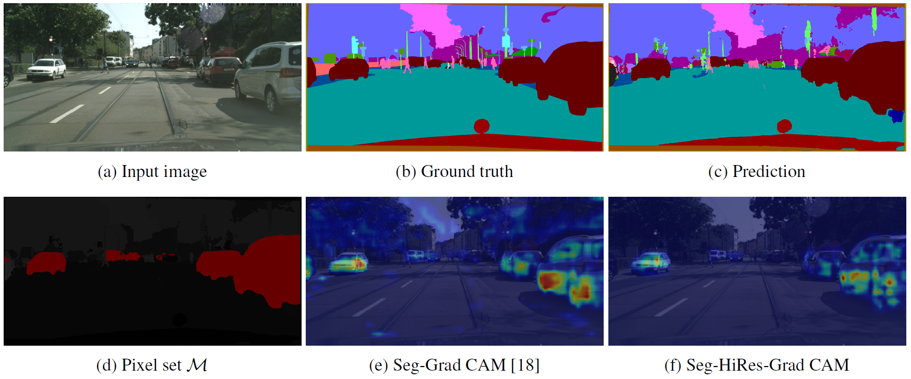

<br />
<div align="center">

  <h3 align="center">Seg-HiRes-Grad CAM</h3>

  <h5 align="center">Paper URL coming soon</h5>

  <p align="justify">
    Convolutional neural networks (CNNs) achieve prevailing results in segmentation tasks nowadays and represent the state-of-the-art for image-based analysis. However, the understanding of the accurate decision-making process of a CNN is rather unknown. The research area of explainable artificial intelligence (xAI) primarily revolves around understanding and interpreting this black-box behavior. One way of interpreting a CNN is the use of class activation maps (CAMs) that represent heatmaps to indicate the importance of image areas for the prediction of the CNN. For classification tasks, a variety of CAM algorithms exist. But for segmentation tasks, only one CAM algorithm for the interpretation of the output of a CNN exist. We propose a transfer between existing classification- and segmentation-based methods for more detailed, explainable, and consistent results which show salient pixels in semantic segmentation tasks. The resulting Seg-HiRes-Grad CAM is an extension of the segmentation-based Seg-Grad CAM with the transfer to the classification-based HiRes CAM. Our method improves the previously-mentioned existing segmentation-based method by adjusting it to recently published classification-based methods. Especially for medical image segmentation, this transfer solves existing explainability disadvantages.  
  </p>
  
  <a href="https://github.com">
    
  </a>
</div>


# Requirements
Python 3.9.12, PyTorch 1.11.0, NumPy 1.21.5, Image PIL, torchvision 0.12.0


# Data and Model Preparation
Please structure the data and model as the folders in this repository, e.g. as follows:
```bash
├──data 
    ├──dataset_1 (e.g. cityscapes)
          ├──test
              ├──images
                  ├──files.png
              ├──masks
                  ├──files.png
    ├──dataset_2
          ├──...
├──results 
    ├──modelname (e.g. vanilla_unert)
          ├──models
              ├──dataset_1 (e.g. cityscapes)
                  ├──modelfile
    ├──modelname
          ├──...
``` 

The convolutional neural network model has to be adjusted (if it is not the U-Net which is in this repository) such that it can be used out of the box with the ```main.py``` in this repository, e.g. as the following minimal example:
```bash
class Vanilla_UNet_2d(nn.Module):
    def __init__(self, grad_cam=False):
        super(Vanilla_UNet_2d, self).__init__()
        
        self.grad_cam = grad_cam # activate this for .eval() the model 
        
    def activations_hook(self, grad): 
        # for GradCam
        self.gradients = grad
    
    def forward(self, x):
        # do something
        
        # encoder
        
        # i want the explanation of this layer
        # for GradCam
        if self.grad_cam: self.h = x.register_hook(self.activations_hook)
        
        # decoder
    
        return x
    
    def get_act_grad(self):
        # for GradCam
        return self.gradients
    
    def get_act(self, x):
        # for GradCam
        for block in self.encoder:
            # send the tensor to the encoder block and get the encoded tensor before and after the max pooling operation
            x_pre_pool, x_post_pool = block(x)
            # save the encoded tensor before the max pooling operation for the skip connection part later
            x = x_post_pool
        x = x_pre_pool

        return x 
``` 

To run Seg(-HiRes)-Grad CAM, the ```main.py``` file provides the relevant arguments. Alternatively, one could implement (Seg-HiRes-)Grad CAM by using PyTorch's [hooks]([https://www.google.com](https://pytorch.org/docs/stable/generated/torch.Tensor.register_hook.html)).


# References
Kira Vinogradova, Alexandr Dibrov, et al. “Towards Interpretable Semantic Segmentation via Gradient-Weighted Class Activation Mapping (Student Abstract)”. In: vol. 34.10. Apr. 2020, pp. 13943–13944. DOI: 10.1609/aaai.v34i10.7244.

Marius Cordts, Mohamed Omran, et al. “The Cityscapes Dataset for Semantic Urban Scene Understanding”. In: 2016 IEEE Conference on Computer Vision and Pattern Recognition, CVPR 2016, Las Vegas, NV, USA, June 27-30, 2016. IEEE Computer Society, 2016, pp. 3213–3223. DOI: 10.1109/CVPR.2016.350.

N. Heller et al., “The state of the art in kidney and kidney tumor segmentation in contrast-enhanced CT imaging: Results of the KiTS19 Challenge,” Medical Image Analysis, p. 101821, 2020.

# Citation
Please cite the work with the following information (bibtex format):
...
